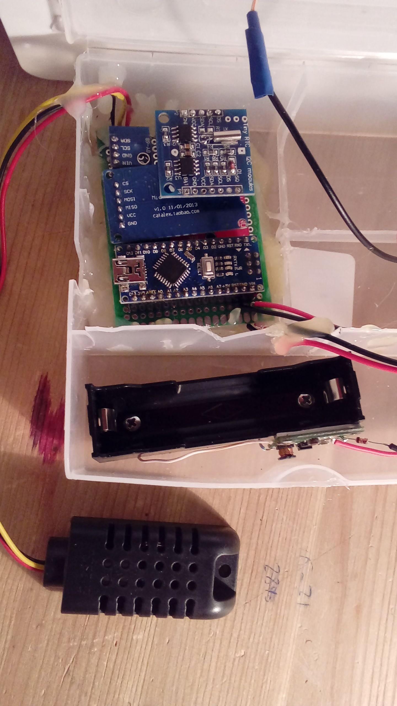

# Arduino_Smart_GreenHouse
Умная теплица на ардуино.

## Сбор парамтеров и запись на sd

https://github.com/bakaut/Arduino_Smart_GreenHouse/blob/master/modules/temp-pressure-hum-sd.ino

Платформа:

* Arduino Nano

Функционал:

* Температура воздуха. Внутри. Снаружи. (DHT22 DHT11)
* Влажность воздуха. Внутри. Снаружи. (DHT22 DHT11)
* Атмосферное давление. (BPM180)
* Дельта температы внутри и снуружи.
* Дельта влажности внутри и снаружи.
* Дельта роста или падения давления.
* Контроль параметров по времени (RTC DS1307)

Измерения каждые 10 минут. Запись показаний датчиков каждые 10 минут на sd карту в формате influx

Электропитание:
* Литиевая батарейка 2500ma, 48 часов.
* Солнечные панели. В светлое время суток. Если тока хватает
* Потребление тока. 30-60 ma при работе. При отключённых датчиках 10-30ma.
* Энергесбережение:
  * Все датчики через транзистор отключаются. Включаются только на 15 секунд каждые 10 минут
  * Питание от солнечных батарей

## Отправка данных в облако:

https://github.com/bakaut/Arduino_Smart_GreenHouse/blob/master/modules/gprs-web-post-request.example.ino

Платформа:
* Arduino Mega (на nano не получилось сделать)

Функционал:
* Чтение с sd карты
* Отправка в облако через gsm модуль (A7 I thinker)

## Фото проекта

